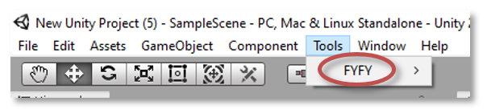

# FYFY - FamilY For unitY #
FYFY is an Entity Component System (ECS) made for Unity. ECS software architecture is interesting for two main reasons: optimization and modularity.

## What FYFY is? ##
FYFY was designed for teaching purposes to help beginners to understand data-driven simulation and to play with ECS mechanisms. FYFY is focused on the modularity interest of ECS. We try to make it easy to use and well-integrated into the Unity editor.

## What FYFY is not? ##
FYFY doesn't focus on optimization. If you are interested in high performances games use the native ECS of Unity instead: https://learn.unity.com/tutorial/entity-component-system#

## Repository structure ##
* FYFY folder is the main part of this project, it includes source code that enables you to manage Systems, Families and so on.
* FYFY_Inspector folder includes source code to easily manage FYFY in Unity editor.
* FYFY_plugins folder includes official plugins made to complete FYFY core.

# Short Introduction to FYFY #
## How to add FYFY to your project? ##
1. Drag and drop dll and xml files of the latest release in your Asset folder.
2. Create the MainLoop with the FYFY menu
  

3. Now you can begin to code your systems and play with ECS, enjoy!

## What are FYFY entities? ##
Each Unity GameObject is processed as an entity in the FYFY context.

## What are FYFY components? ##
A FYFY component extends MonoBehaviour and contains only public data (no functions):

```C#
using UnityEngine;

public class FYFYComponentExample : MonoBehaviour {
    // Advice: FYFY component aims to contain only public members
    public int firstValue;
    public GameObject secondValue;
    public string thirdValue;
}
```

## What are FYFY systems? ##
A FYFY system extends FSystem:

```C#
using UnityEngine;
using FYFY;

public class FYFYSystemExemple : FSystem {
    // Use the constructor to init member variables when system is created
    public FYFYSystemExemple() {
    }

    // Use this to update member variables when system pause. 
    protected override void onPause(int currentFrame) {
    }

    // Use this to update member variables when system resume.
    protected override void onResume(int currentFrame){
    }

    // Use to process your families.
    protected override void onProcess(int familiesUpdateCount) {
    }
}
```
A FYFY system uses families to get entities to process on. In the following example, the system builds a family that filters all game objects that contains the ```FYFYComponentExample``` component and increments their ```firstValue``` member:
```C#
using UnityEngine;
using FYFY;

public class FYFYSystemExample : FSystem {

    private Family familyExample = FamilyManager.getFamily(new AllOfComponents(FYFYComponentExample));

    // Use to process your families.
    protected override void onProcess(int familiesUpdateCount) {
        foreach (GameObject go in familyExample)
        {
            go.GetComponent<FYFYComponentExample>().firstValue++;
        }
    }
}
```

## What are families? ##
Family is the mecanism that enables systems to access entities (GameObjects). Families are built by the FamilyManager with the help of a set of matchers:
### Matchers on components ###
* AllOfComponents enables to filter GameObjects that contain all of specified components.
```C#
// Define a family that selects all GameObjects that contain Move and RandomTarget components
Family myFamily = FamilyManager.getFamily(new AllOfComponents(typeof(Move), typeof(RandomTarget)));
```
* AnyOfComponents enables to filter GameObjects that contain at least on of the specified components.
```C#
// Define a family that selects all GameObjects that contain Move or RandomTarget components (or both)
Family myFamily = FamilyManager.getFamily(new AnyOfComponents(typeof(Move), typeof(RandomTarget)));
```
* NoneOfComponents enables to filter GameObjects that don't contain the specified components.
```C#
// Define a family that selects all GameObjects that don't contain Move and RandomTarget components
Family myFamily = FamilyManager.getFamily(new NoneOfComponents(typeof(Move), typeof(RandomTarget)));
```
### Matchers on layers ###
* AnyOfLayers enables to filter GameObjects that are part of the specified layers.
```C#
// Define a family that selects all GameObjects that are part of layer 5, 6 or 7
Family myFamily = FamilyManager.getFamily(new AnyOfLayers(5, 6, 7));
```
* NoneOfLayers enables to filter GameObjects that are not part of the specified layers.
```C#
// Define a family that selects all GameObjects that are not part of layer 5, 6 or 7
Family myFamily = FamilyManager.getFamily(new NoneOfLayers(5, 6, 7));
```
### Matchers on tags ###
* AnyOfTags enables to filter GameObjects that are associated to one of the specified tags.
```C#
// Define a family that selects all GameObjects tagged "virus" or "bactery"
Family myFamily = FamilyManager.getFamily(new AnyOfTags("virus", "bactery"));
```
* NoneOfTags enables to filter GameObjects that are not associated to one of the specified tags.
```C#
// Define a family that selects all GameObjects that are not tagged "virus" and "bactery"
Family myFamily = FamilyManager.getFamily(new NoneOfTags("virus", "bactery"));
```
### Matchers on properties ###
Four properties are currently managed by FYFY. These properties are defined inside ```PropertyMatcher``` enum: ACTIVE_SELF, ACTIVE_IN_HIERARCHY, HAS_PARENT and HAS_CHILD.
* AllOfProperties enables to filter GameObjects that check all of specified properties.
```C#
// Define a family that selects all GameObjects that are active in hierarchy and has a parent
Family myFamily = FamilyManager.getFamily(new AllOfProperties(PropertyMatcher.PROPERTY.ACTIVE_IN_HIERARCHY,
                      PropertyMatcher.PROPERTY.HAS_PARENT));
```
* AnyOfProperties enables to filter GameObjects that check at least one of the specified properties.
```C#
// Define a family that selects all GameObjects that are active in hierarchy or has a parent
Family myFamily = FamilyManager.getFamily(new AnyOfProperties(PropertyMatcher.PROPERTY.ACTIVE_IN_HIERARCHY,
                      PropertyMatcher.PROPERTY.HAS_PARENT));
```
* NoneOfProperties enables to filter GameObjects that do not check all of specified properties.
```C#
// Define a family that selects all GameObjects that are not active in hierarchy and has not a parent
Family myFamily = FamilyManager.getFamily(new NoneOfProperties(PropertyMatcher.PROPERTY.ACTIVE_IN_HIERARCHY,
                      PropertyMatcher.PROPERTY.HAS_PARENT));
```
### Matchers combination ###
It is possible to combine matcher to build the system appropiate filter. For instance following family will contain all GameObjects active in hierarchy with components Move and RandomTarget and not Velocity, and part of layer 3 or 7
```C#
Family myFamily = FamilyManager.getFamily(
    new AllOfProperties(PropertyMatcher.PROPERTY.ACTIVE_IN_HIERARCHY),
    new AllOfComponents(typeof(Move), typeof(RandomTarget)),
    new NoneOfComponents(typeof(Velocity)),
    new AnyOfLayers(3, 7));
```
### Family listeners ###
Because game simulation is dynamic some GameObjects enters and leaves families at runtime. You can define listener on families to catch these events.
```C#
// Family definition
Family myFamily = FamilyManager.getFamily (...);
// Add listener to call back when a GameObject enters into this family
myFamily.addEntryCallback (onGameObjectEnter);
// Add listener to call back when a GameObject leaves this family
myFamily.addExitCallback (onGameObjectExit);

void onGameObjectEnter (GameObject addingGo){
    ...
}
void onGameObjectExit (int removingGoInstanceId){
    ...
}
```
## GameObjectManager ##
The GameObjectManager enables FYFY to keep synchronized with Unity simulation. If you choose to experiment FYFY you have to replace some of the classic Unity calls with overloaded GameObjectManager calls:
```C#

GameObject go = Instantiate(prefab);
// Bind each new GameObject to FYFY
GameObjectManager.bind(go);

// Unbind all GameObject before destroying it
GameObjectManager.unbind(go);
Destroy(go);

// Replace all classic AddComponent calls
go.AddComponent<FYFYComponentExample>();
// with
GameObjectManager.addComponent<FYFYComponentExample>(go);

// Replace all component destruction
FYFYComponentExample fce = go.GetComponent<FYFYComponentExample>();
Destroy(fce);
// with
GameObjectManager.removeComponent<FYFYComponentExample>(go);

// Replace all changes on active state
go.SetActive(false);
// with
GameObjectManager.setGameObjectState(go, false);

// Replace all hierarchical updates
go.transform.SetParent(newParent, true);
// with
GameObjectManager.setGameObjectParent(go, newParent, true);

// Replace all scene loadind
UnityEngine.SceneManagement.SceneManager.LoadScene(sceneName);
// with
GameObjectManager.loadScene(sceneName);

// Replace all DontDestroyOnLoad calls
DontDestroyOnLoad(go);
// with
GameObjectManager.dontDestroyOnLoadAndRebind(go);
```
## Link UI events with systems ##
If you define inside a system a void public function with a maximum of one parameter, FYFY give you access to this function through the Main_Loop to link it on UI events.

